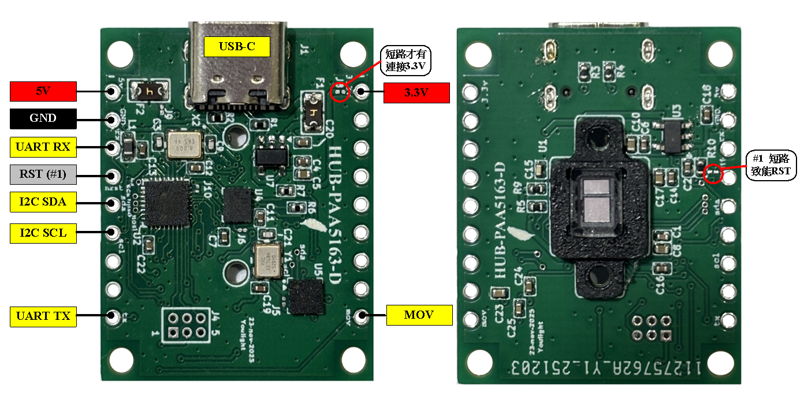
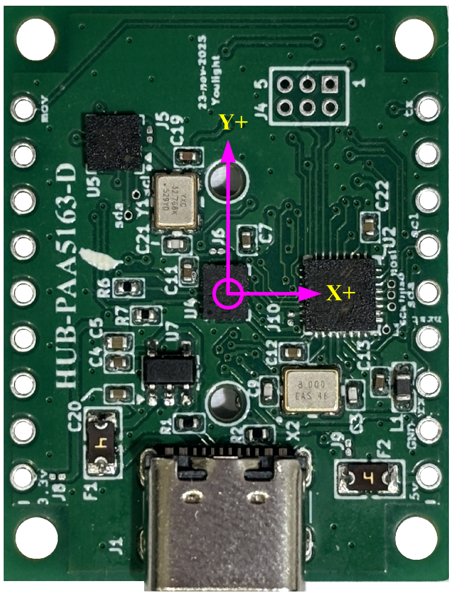

# HUB-PAA5163D 位置移動感測模組

| 項目               | 說明       |
| ------------------ | ---------- |
| **版本**     | V2.4       |
| **日期**     | 2026-04-01 |
| **韌體版本** | v1.0.4     |
| **作者**     | 顏仲良     |

---

## 1. Overview

HUB-PAA5163D 是一款高精度位置移動感測模組，整合了光流感測器、6軸IMU和3軸電子羅盤，提供完整的2D位移追蹤和姿態測量功能。

### 主要特色

- **高精度位移追蹤**：結合 PAA5163 光流感測器，支援 5-40mm 感測高度
- **6軸IMU**：ICM42688 陀螺儀 (±2000dps) + 加速度計 (±16g)
- **3軸電子羅盤**：QMC5883P 磁力計，支援傾斜補償
- **雙通訊介面**：
  - **UART/USB**：AT 指令控制，適合調試和人機互動
  - **I2C Slave**：寄存器讀寫，適合嵌入式系統整合
- **即時座標計算**：自動角度補償的X/Y座標輸出
- **低延遲更新**：位移更新週期 8ms，姿態更新週期 2ms
- **自動介面切換**：偵測到 I2C 通訊時自動切換模式

### 應用領域

- 機器人定位與導航
- 室內定位系統
- AGV（自動導引車）
- 遊戲控制器
- 手勢識別

---

## 2. 硬體規格

### 微控制器

- **型號**：HT32F49153
- **核心**：32-bit Arm Cortex-M4F
- **時脈**：144 MHz
- **記憶體**：128KB Flash, 48KB SRAM
- **EEPROM模擬**：1KB (Flash模擬)

### 感測器

#### PAA5163 光流感測器

- **解析度**：1000 CPI (可設定)
- **感測高度**：5mm - 40mm
- **最大速度**：>100 inch/s
- **介面**：SPI (最高 2MHz)

#### ICM42688 六軸 IMU

- **陀螺儀量程**：±2000 dps
- **加速度計量程**：±16g
- **更新率**：500 Hz
- **介面**：I2C (400kHz)

#### QMC5883P 電子羅盤

- **量程**：±8 Gauss
- **解析度**：12-bit
- **更新率**：50 Hz
- **介面**：I2C (400kHz)
- **功能**：支援傾斜補償

### 電源規格

- **工作電壓**：5V (USB供電)
- **工作電流**：約 150mA
- **功耗**：約 0.75W

---

## 3. 通訊介面

HUB-PAA5163D 提供三種通訊方式，可根據應用需求選擇：

### 介面對比

| 特性               | UART/USB 介面        | I2C Slave 介面       |
| ------------------ | -------------------- | -------------------- |
| **主要用途** | 調試、測試、人機互動 | 嵌入式系統整合       |
| **控制方式** | AT 指令（文字）      | 寄存器讀寫（二進位） |
| **數據格式** | 文字或JSON           | 二進位結構體         |
| **啟用方式** | 預設啟用             | 自動偵測 I2C 通訊    |
| **通訊速率** | 115200 bps           | 200 kHz              |
| **適用場景** | PC連接、終端操作     | MCU對MCU通訊         |
| **複雜度**   | 簡單（字串處理）     | 中等（寄存器操作）   |
| **即時性**   | 中（輪詢）           | 高（直接記憶體）     |
| **典型應用** | 開發、除錯、示範     | 機器人、嵌入式產品   |

### 介面切換規則

1. **預設狀態**：模組上電後使用 UART/USB/I2C 介面
2. **自動切換至 I2C**：當檢測到 I2C Slave 通訊時：
   - UART 及 USB串口自動關閉
   - 進入 I2C Slave 模式，運行模式切換為座標模式
   - 所有感測器數據透過 I2C 寄存器訪問
3. **自動切換回 UART**：當檢測到 UART 通訊時：
   - I2C Slave/USB 模式關閉
   - UART 運行 AT 指令模式
4. **切換回 USB**：當檢測到 USB 連接時：
   - UART/I2C slave 模式關閉
   - USB 虛擬串口啟用
   - USB 運行 AT 指令模式
5. **恢復 其它介面**：需要重新上電或硬體重置

**注意**：三種介面不能同時使用，系統會根據檢測到的通訊自動選擇。

---

## 4. 硬體說明

### 引腳定義

### 硬體座標定義

  

#### USB 介面

- **功能**：虛擬串口通訊 (CDC)
- **速率**：115200 bps
- **用途**：主要指令介面、數據輸出

#### UART 介面

| 引腳 | 功能    | 說明 |
| ---- | ------- | ---- |
| PA2  | UART TX | 發送 |
| PA3  | UART RX | 接收 |

- **速率**：115200 bps, 8N1
- **用途**：備用串口通訊
- **啟用方式**：RX (PA3) 腳位上拉至高電平時自動啟用

#### I2C2 Slave 介面

| 引腳 | 功能    | 說明   |
| ---- | ------- | ------ |
| PA0  | I2C SDA | 數據線 |
| PA1  | I2C SCL | 時鐘線 |

- **I2C 地址**：0x52 (7-bit) / 0xA4 (8-bit 寫) / 0xA5 (8-bit 讀)
- **速率**：200 kHz（標準模式）
- **用途**：作為 I2C Slave 供外部 MCU 讀寫
- **啟用方式**：當偵測到 I2C 通訊時自動啟用並關閉 UART
- **上拉電阻**：需要 4.7kΩ 上拉至 3.3V
- **寄存器大小**：53 bytes（詳見 [./docs/USERGUIDE.md](./docs/USERGUIDE.md#i2c-slave-介面使用)）

#### 其他控制引腳

| 引腳 | 功能     | 說明                                     |
| ---- | -------- | ---------------------------------------- |
| PB1  | MOV      | 移動指示輸出（可透過 I2C 控制啟用/停用） |
| PB5  | PAA_NRST | PAA5163 硬體重置（可透過 I2C 控制）      |

---

## 5. Applendix 附錄

### A. 座標系統說明

- **X軸**：向右為正
- **Y軸**：向前為正
- **Z軸**：向上為正（右手座標系）
- **角度**：逆時針為正（俯視）

### B. 高度校正係數表

模組內建 36 組高度校正係數（5mm ~ 40mm），用於提高不同高度下的位移精度。

| 高度範圍 (mm) | 建議應用           |
| ------------- | ------------------ |
| 5-10          | 桌面應用、精密定位 |
| 10-20         | 一般室內導航       |
| 20-30         | 機器人、AGV        |
| 30-40         | 高架應用           |

### C. 效能指標

- **位移解析度**：約 0.025 cm (@ 1000 CPI)
- **角度解析度**：0.1°
- **最大移動速度**：> 2.5 m/s
- **最大旋轉速度**：> 2000 dps
- **位移精度**：< 2% (理想條件)
- **延遲時間**：< 10 ms

### D. 環境要求

- **工作溫度**：-20°C ~ +70°C
- **儲存溫度**：-40°C ~ +85°C
- **相對濕度**：10% ~ 90% (無凝結)
- **照度範圍**：100 ~ 10000 Lux

### E. I2C 時序要求

- **時鐘速率**：最高 200 kHz（標準模式）
- **建立時間 (Setup)**：> 100 ns
- **保持時間 (Hold)**：> 100 ns
- **上拉電阻**：4.7kΩ（推薦值）
- **最大線長**：< 30 cm @ 200kHz
- **超時建議**：
  - 單 byte 讀取：100 μs
  - Word (2 bytes) 讀取：200 μs
  - Float (4 bytes) 讀取：300 μs
  - 感測器更新：800 ms

### F. 數據格式對比

| 項目         | UART/USB       | I2C Slave        |
| ------------ | -------------- | ---------------- |
| 數據格式     | ASCII 文字     | 二進位結構體     |
| 典型封包大小 | 40-80 bytes    | 53 bytes         |
| 解析複雜度   | 高（字串處理） | 低（直接記憶體） |
| 傳輸效率     | 低             | 高               |
| 人類可讀性   | 高             | 低               |
| 除錯難度     | 低             | 中               |
| 即時性       | 中             | 高               |

### G. 參考資源

- **完整 I2C 範例**：test_hub5168_i2c/test_hub5168_i2c.ino
- **寄存器定義**：i2c_slave_regs_t 結構體
