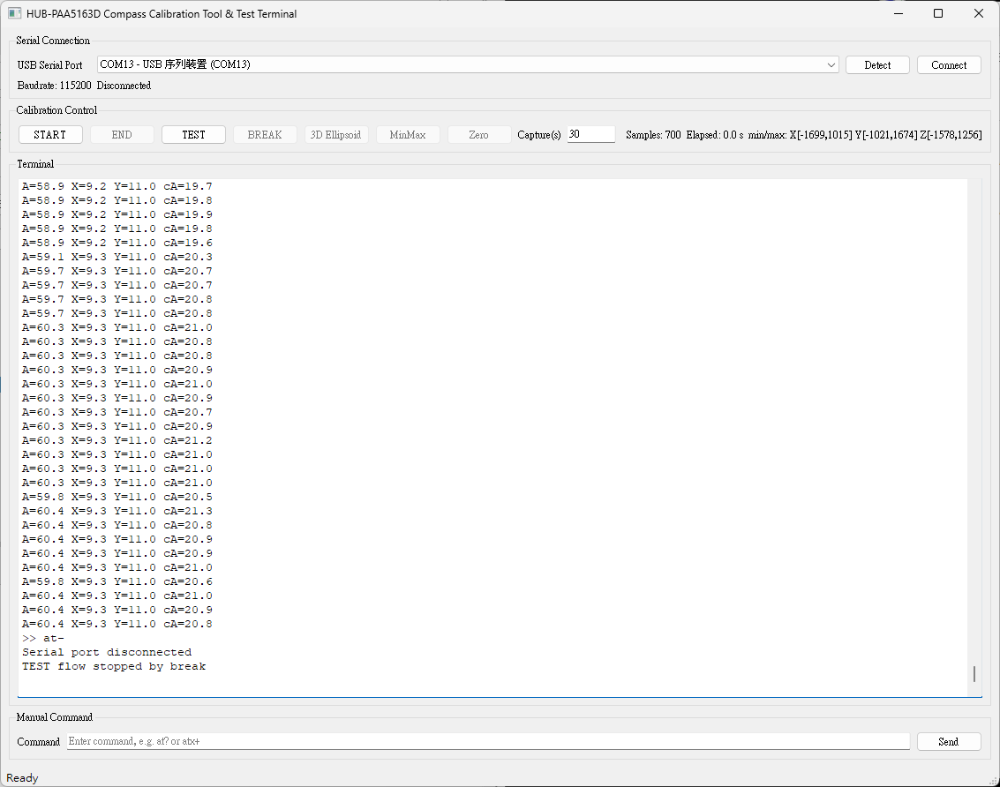
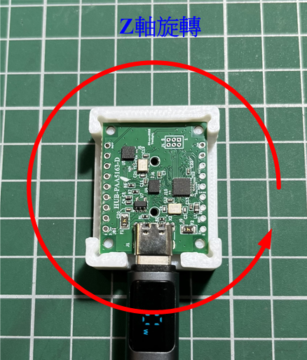
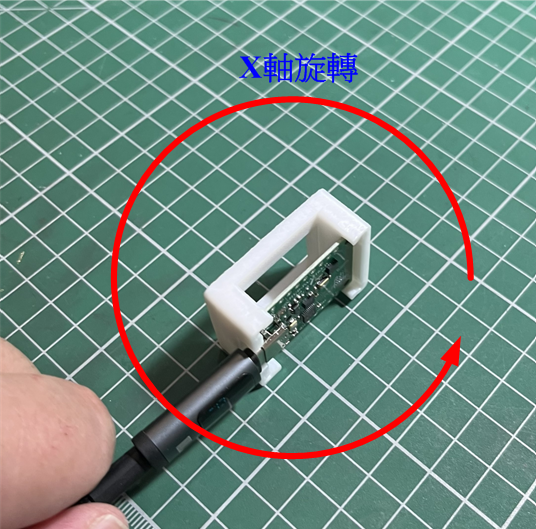
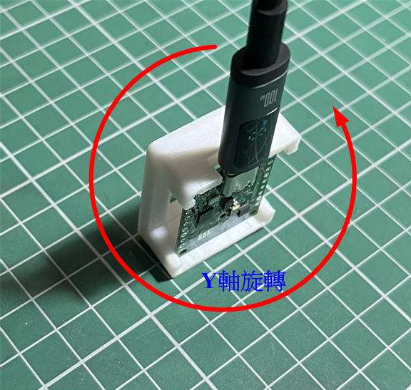

# 地磁校正

本章節說明 `cmps_tool` 地磁校正工具之用途、操作流程與注意事項，適用於透過 USB Serial 對 HUB-PAA5163D 進行羅盤資料擷取、3D Ellipsoid 校正與參數回寫。

## 工具目的

`cmps_tool.py` 是一個桌面 GUI 工具，用於透過 USB Serial 與 HUB-PAA5163D 裝置通訊，提供以下功能：

- 羅盤原始資料擷取
- 3D Ellipsoid 校正計算
- Min/Max 資料回寫
- 測試命令流程執行
- 一般 AT 指令手動送出與終端機監看

此工具同時具備「校正工具」與「測試終端機」兩種用途。

## 執行環境

### Windows 11

執行 `cmps_tool/cmps_tool_win.exe`

### x86 amd64 Ubuntu Linux

執行 `cmps_tool/cmps_tool`

### HUB-PAA5163D 裝置韌體

需要搭配支援 AT 指令的 HUB-PAA5163D 裝置韌體版本 v1.0.4 之後，請確認裝置韌體已更新至支援以下命令：

- `atcraw+`：開始輸出羅盤原始資料
- `at-`：停止目前動作或資料輸出
- `atc3d=...`：寫入 3D Ellipsoid 校正參數
- `ati&...`：寫入 X/Y/Z Min/Max 值
- `atcme+`：啟用 3D Ellipsoid 模式
- `atcme-`：切換到 Min/Max 模式

---

## 介面說明

主視窗標題為 `HUB-PAA5163D Compass Calibration Tool & Test Terminal`，畫面主要分為四個區塊。



### Serial Connection

- `USB Serial Port`：列出目前偵測到的序列埠
- `Detect`：重新掃描 USB Serial 裝置
- `Connect` / `Disconnect`：建立或中斷序列埠連線
- `Baudrate`：固定為 `115200`
- 狀態列：顯示目前是否已連線

### Calibration Control

校正按鈕與顯示說明：

- `START`：開始羅盤原始資料擷取與校正流程
- `END`：停止擷取，計算校正值並回寫 MCU
- `Capture(s)`：設定擷取逾時秒數，預設 `30` 秒，可輸入範圍 `1` 到 `600` 秒；若超時未按 `END`，程式會自動結束擷取並進行校正，計算校正值後回寫 MCU 並顯示結果
- `Status`：顯示目前校正狀態，例如 `Ready`、`Disconnected`、`Connected` 等

測試按鈕與顯示說明：

- `TEST`：啟動測試流程
- `BREAK`：中止測試流程，送出停止命令並斷線
- `3D Ellipsoid`：送出 `atcme+`，切換至 3D Ellipsoid 校正模式
- `MinMax`：送出 `atcme-`，切換到 Min/Max 模式
- `Zero`：送出 `at0g+`，執行設定零點命令
- `Samples`：顯示目前已收到的樣本數
- `Elapsed`：顯示本次擷取已經過的時間
- `min/max`：顯示目前累積的 X/Y/Z 最小值與最大值

### Terminal

- 顯示收發紀錄與內部流程訊息
- 視窗大小設計為約 `125 x 30` 字元
- 只讀，不可直接編輯
- 保留最多 `5000` 筆文字區塊

### Manual Command

- 可直接輸入 AT 指令並送出
- `Send`：送出目前輸入內容
- 按 `Enter` 也可送出
- 支援上下方向鍵瀏覽歷史命令

---

## 基本連線流程

### 連線步驟

1. 接上裝置 USB Serial。
2. 按下 `Detect`。
3. 在下拉選單選擇對應埠。
4. 按下 `Connect`。

連線成功後，工具會：

- 開始輪詢序列埠資料
- 顯示 `Connected: <device>`
- 在終端機記錄連線訊息
- 自動送出 `at`

若未選擇埠或開啟失敗，畫面會跳出錯誤對話框。

#### 中斷連線

按下 `Disconnect` 後會：

- 停止資料輪詢
- 結束可能進行中的校正流程
- 結束可能進行中的測試流程
- 關閉序列埠

### 校正流程

#### START 後的動作

按下 `START` 後，程式會依序執行：

1. 若尚未連線，先自動嘗試連線。
2. 檢查 `Capture(s)` 是否為有效整數，且介於 `1` 到 `600` 秒。
3. 清空上一輪樣本資料。
4. 重設最小值、最大值、計時器與接收緩衝。
5. 啟動擷取逾時計時。
6. 送出 `atcraw+`，要求 MCU 連續輸出羅盤原始值。
7. 進行三軸方向旋轉（每軸至少一圈）。







#### 擷取資料格式

程式會從序列輸出中解析下列格式：

```text
mx=<value> my=<value> mz=<value>
```

例如：

```text
mx=-123 my=456 mz=789
```

每收到一筆符合格式的資料，程式會：

- 累積一筆 `(mx, my, mz)` 樣本
- 更新 X/Y/Z 的最小值與最大值
- 更新 `Samples` 與 `min/max` 顯示

#### END 或逾時後的動作

當按下 `END` 或達到逾時秒數後，程式會：

1. 停止擷取狀態。
2. 送出 `at-`。
3. 記錄 `Capture ended`。
4. 若樣本數不足 `60` 筆，停止後續校正。
5. 若樣本數足夠，進行 3D Ellipsoid 擬合。

#### 校正計算條件

程式要求至少 `60` 筆樣本才能進行 3D 擬合。

若樣本數不足，終端機會顯示類似訊息：

```text
Not enough samples for 3D fit: <count> collected, need at least 60
```

#### 校正演算法

程式優先使用 direct fit 方式建立橢球模型；若 direct fit 失敗，則改用 covariance fallback。

計算結果包含：

- Offset：`bx`, `by`, `bz`
- 3x3 矩陣：`w11` 到 `w33`
- 擬合品質資訊：`radius_mean`, `radius_std`
- 使用方法：`direct` 或 `covariance-fallback`

結果會顯示在終端機中。

#### 校正值回寫 MCU

校正成功後，程式會依序送出以下命令：

1. `atc3d=<bx>,<by>,<bz>,<w11>,...,<w33>`
2. `ati&<minX>,<maxX>,<minY>,<maxY>,<minZ>,<maxZ>`
3. `atcme+`

其中：

- `atc3d=` 用於寫入 3D Ellipsoid 參數
- `ati&` 用於寫入 Min/Max 統計值
- `atcme+` 用於啟用 3D Ellipsoid 校正模式

每兩步回寫之間，程式會保留約 `350 ms` 的處理間隔。

全部成功後，狀態列會顯示：

```text
Calibration completed and written to MCU
```

## TEST 測試流程

### TEST 按下後的動作

按下 `TEST` 後，程式會：

1. 若校正流程正在進行，拒絕啟動測試。
2. 若尚未連線，先自動嘗試連線。
3. 設定測試狀態為啟用。
4. 送出 `atx+`。
5. 啟動單次計時器，`3` 秒後自動送出 `at0g+`。

終端機會顯示：

```text
TEST flow started
```

三秒後會再顯示：

```text
TEST flow step completed (at0g+ sent), waiting for BREAK
```

### BREAK 按下後的動作

按下 `BREAK` 後，程式會：

1. 送出 `at-`。
2. 停止 TEST 狀態。
3. 主動中斷序列埠。
4. 在終端機記錄 `TEST flow stopped by break`。

### 模式切換與 Zero 功能

#### 3D Ellipsoid

按下 `3D Ellipsoid` 會送出：

```text
atcme+
```

狀態列顯示：

```text
Calibration mode set to 3D Ellipsoid
```

#### MinMax

按下 `MinMax` 會送出：

```text
atcme-
```

狀態列顯示：

```text
Calibration mode set to min/max
```

#### Zero

按下 `Zero` 會送出：

```text
at0g+
```

狀態列顯示：

```text
Zero command sent
```

### 按鈕可用狀態

依照目前程式邏輯：

| 狀態         | Zero   | 3D Ellipsoid | MinMax |
| ------------ | ------ | ------------ | ------ |
| 未連線       | 不可用 | 不可用       | 不可用 |
| 已連線，閒置 | 可用   | 可用         | 可用   |
| Capture 中   | 不可用 | 不可用       | 不可用 |
| TEST 中      | 可用   | 可用         | 可用   |

註：此表為 `cmps_tool.py` 目前實作邏輯整理結果。

---

## 手動指令功能

### 使用方式

在 `Manual Command` 輸入框輸入指令，例如：

```text
at?
```

或：

```text
atx+
```

按 `Enter` 或 `Send` 後送出。

#### 限制條件

若尚未連線，程式會跳出警告視窗，要求先連線後再送命令。

#### 歷史命令

- `↑`：切換到上一筆命令
- `↓`：切換到下一筆命令或返回目前草稿

若連續輸入相同命令，程式不會重複新增到歷史列表尾端。

---

### Terminal 訊息說明

終端機會顯示兩類內容：

- 程式主動送出的命令，格式為 `>> <command>`
- 裝置回傳的文字內容

另外也會顯示流程控制訊息，例如：

- `Connected to ...`
- `Starting raw compass capture ...`
- `Capture ended (...)`
- `Fit complete ...`
- `Calibration parameters written to MCU`

---

## 異常處理

### 序列埠 I/O 錯誤

若在讀寫過程中發生 Serial I/O 錯誤，程式會：

- 停止輪詢與計時器
- 關閉序列埠
- 清除接收狀態
- 清除樣本資料
- 清空命令歷史
- 清空手動命令輸入框
- 清空終端機顯示
- 將整體狀態恢復為預設值
- 重新掃描可用序列埠

終端機會顯示類似：

```text
USB disconnected. State reset to defaults.
```

### 逾時或無效輸入

若 `Capture(s)` 不是整數，或超出 `1` 到 `600` 範圍，程式會跳出警告視窗，不會啟動擷取。

#### 樣本不足

若樣本數少於 `60`，程式只會停止擷取，不會產生與回寫 3D 校正參數。

### 建議操作流程

#### 執行完整校正

1. 啟動程式。
2. 按 `Detect` 掃描裝置。
3. 選擇正確的 USB Serial Port。
4. 按 `Connect`。
5. 確認裝置有正常回應。
6. 設定 `Capture(s)` 秒數。
7. 按 `START`。
8. 在擷取期間緩慢旋轉裝置，盡量覆蓋多方向姿態。
9. 等待逾時結束或按 `END`。
10. 觀察終端機中的擬合結果與回寫結果。

#### 執行測試流程

1. 按 `Detect`。
2. 選擇序列埠。
3. 按 `TEST`。
4. 觀察終端機輸出。
5. 等待 `3` 秒後自動送出 `at0g+`。
6. 完成後按 `BREAK`。

#### 只送單一控制命令

1. 先連線。
2. 視需要按 `3D Ellipsoid`、`MinMax` 或 `Zero`。
3. 或於 `Manual Command` 區塊輸入自訂 AT 指令。

---

## 常用命令整理

本工具在程式內實際使用到的命令如下：

| 命令          | 用途                       |
| ------------- | -------------------------- |
| `at`        | 連線後基本探測命令         |
| `atcraw+`   | 開始輸出羅盤原始資料       |
| `at-`       | 停止目前動作或資料輸出     |
| `atc3d=...` | 寫入 3D Ellipsoid 校正參數 |
| `ati&...`   | 寫入 X/Y/Z Min/Max 值      |
| `atcme+`    | 啟用 3D Ellipsoid 模式     |
| `atcme-`    | 切換到 Min/Max 模式        |
| `atx+`      | 啟動 TEST 流程             |
| `at0g+`     | Zero 命令                  |

---

## 注意事項

- 本工具的序列鮑率固定為 `115200`。
- 校正計算至少需要 `60` 筆樣本，實務上建議遠高於此數量。
- 若擷取期間姿態變化不足，可能導致擬合退化或校正品質不佳。
- 裝置若在操作中斷線，程式會自動重設內部狀態。
- `BREAK` 會在結束測試後直接斷線，為目前程式既定行為。
